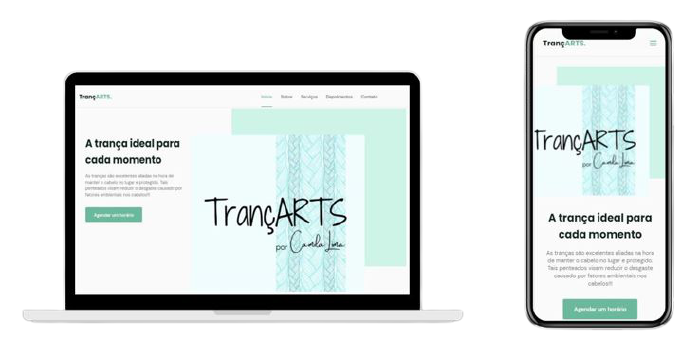

<h1 align="center">
  TrançArts!
</h1>

  <a href="#-tecnologias">Tecnologias</a>&nbsp;&nbsp;&nbsp;|&nbsp;&nbsp;&nbsp;
  <a href="#-projeto">Projeto</a>

 

  

## 🚀 Tecnologias

Esse projeto foi desenvolvido com as seguintes tecnologias:

- HTML
- CSS
- JavaScript

## 💻 Projeto

Projeto desenvolvido tendo como base na NLW da rocketseat, aproveitei os conhecimentos obtidos para poder criar uma página de divulgação para o serviço da minha irmã.
